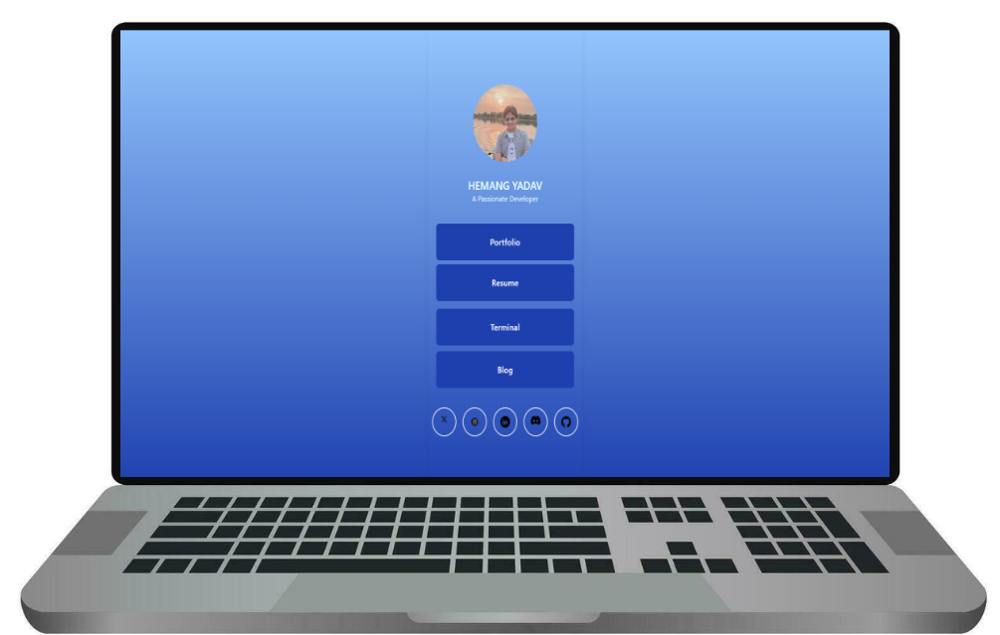
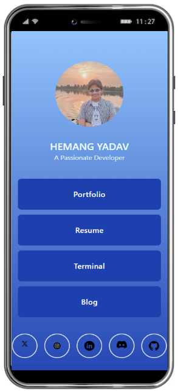

<div align = "center">


<br>

<br>


</div>

<h1 align = "center">
  Zemerik's Linktree
</h1>

<p align = "center">
    Central Hub of Connections
</p>

<p align = "center">
  
</p>

## ❗About:

Welcome to my Central Hub of Connections! Discover an organized and seamless collection of all my key digital links, offering direct access to my projects, social media, portfolio, and more. This hub provides an effortless way to explore the various facets of my online presence, whether you're looking to dive into my work, connect professionally, or stay updated with my latest activities. With a simple yet powerful layout, this central resource allows you to navigate through everything in one convenient place. Explore my links and stay connected to everything I have to offer!

## ⭐ Key Features:

- Find all of my Links

- Connect through Social Media

- Modernized Gradient Background

## 💻 Screenshots:



## 🚀 Quick Start:

### Prerequisites:

- [NodeJS](https://nodejs.org) installed on your machine
- [GIT](https://git-scm.com) installed on your machine
- A Code Editor

### Cloning:

- To make a local copy of this Project on your machine, enter the following `GIT` Commmand in your Terminal:

```bash
git clone https://github.com/Zemerik/Linktree
```

### Installing Dependencies:

- To run this project locally, we first need to download a few `npm` dependencies by using the command below:

```bash
npm i
```

### Locally Running:

- We can locally run this Project on our Network and see the output using the following Command of `NodeJS`:

```bash
npm run dev
```

## 😎 Happy Coding!!

## 🚀 Project Structure

```text
├── public/
│   ├── icons/
├── src/
│   ├── content
│   └── pages/
├── .gitignore
├── astro.config.mjs
├── README.md
├── CODE_OF_CONDUCT.md
├── CONTRIBUTING.md
├── SECURITY.md
├── Licence
├── package.json
├── package-lock.json
├── tailwind.config.mjs
└── tsconfig.tson
```

## 🤝 Contributing:

Contributions are always welcome and appreciated! **Kindly visit the [CONTRIBUTING.md](https://github.com/Zemerik/Resume/blob/main/CONTRIBUTING.md) file for more information**


## 💁 Support:

For any kind of support or inforrmation, you are free to join our **Discord Server**,

<a href = "https://discord.gg/UF9KsmuGbr">
  
</a>

#

<p align = "center">
  Don't forget to leave a ⭐
  <br>
  Made with 💖 by <a href = "https://github.com/Zemerik">Hemang Yadav (Zemerik)</a>
</p>