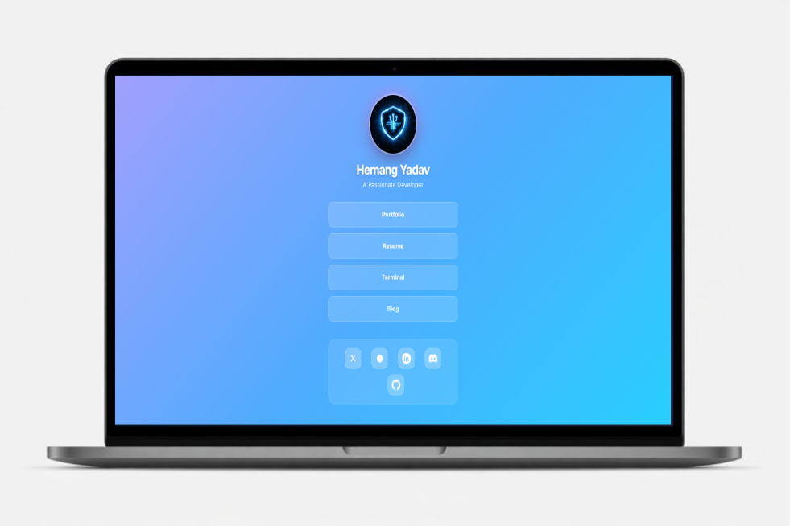

<div align="center">


<br>

<h1>Zemerik's Linktree</h1>

<p>
  <strong>A modern, beautiful link-in-bio solution built with Astro</strong>
</p>

<p>
  
  
  
  
</p>

<br>


<br>
<br>



</div>

---

## ✨ About

Welcome to my **Central Hub of Connections** — a beautifully designed link-in-bio page that serves as a single destination for all my digital presence. Built with modern web technologies, this linktree features stunning visual effects, smooth animations, and an intuitive user experience.

Whether you're looking to explore my projects, connect professionally, or stay updated with my latest work, this hub provides seamless access to everything in one convenient, elegant location.

## 🎨 Features

### Visual Design
- **✨ Animated Gradient Background** - Dynamic color-shifting gradients that create a mesmerizing visual experience
- **🔮 Glassmorphism Effects** - Modern frosted glass styling on all interactive elements
- **💫 Animated Particles** - Subtle floating particles for added visual depth
- **🎭 Smooth Animations** - Polished transitions and hover effects throughout

### User Experience
- **📱 Fully Responsive** - Optimized for all devices and screen sizes
- **⚡ Fast Performance** - Lightweight and optimized for quick loading
- **♿ Accessible** - Built with accessibility best practices in mind
- **🎯 Intuitive Navigation** - Clean, organized layout for easy browsing

### Technical Highlights
- Built with **[Astro](https://astro.build)** for optimal performance
- Styled with **[Tailwind CSS](https://tailwindcss.com)** for rapid development
- Modern **TypeScript** support
- SEO-friendly and optimized for social sharing

## 🚀 Quick Start

### Prerequisites

Make sure you have the following installed on your machine:

- **[Node.js](https://nodejs.org/)** (v16 or higher recommended)
- **[Git](https://git-scm.com/)** for version control
- A code editor (VS Code recommended)

### Installation

1. **Clone the repository**
   ```bash
   git clone https://github.com/Zemerik/Linktree.git
   cd Linktree
   ```

2. **Install dependencies**
   ```bash
   npm install
   ```

3. **Start the development server**
   ```bash
   npm run dev
   ```

4. **Open your browser**
   
   Navigate to `http://localhost:4321` to see your linktree in action!

### Building for Production

```bash
npm run build
```

The built site will be in the `dist/` directory, ready to deploy to your favorite hosting platform.

## 📁 Project Structure

```
Linktree/
├── public/                 # Static assets
│   ├── icons/            # Social media icons
│   ├── branding.png      # Profile image
│   ├── icon.png          # Favicon
│   └── screenshot.png    # Preview image
├── src/
│   ├── pages/
│   │   └── index.astro   # Main page component
│   ├── content/          # Content types
│   └── env.d.ts          # TypeScript definitions
├── astro.config.mjs      # Astro configuration
├── tailwind.config.cjs   # Tailwind CSS configuration
├── package.json          # Dependencies and scripts
└── README.md             # This file
```

## 🛠️ Customization

### Adding Links

Edit the `links` array in `src/pages/index.astro`:

```astro
const links = [
  {
    name: "Your Link Name",
    url: "https://your-link-url.com",
  },
  // Add more links...
];
```

### Adding Social Media Icons

Update the `socialLinks` array in `src/pages/index.astro`:

```astro
const socialLinks = [
  {
    name: "Platform Name",
    url: "https://your-profile-url.com",
    image: "/icons/platform-icon.png",
  },
  // Add more social links...
];
```

### Styling

The project uses Tailwind CSS for styling. You can customize colors, spacing, and other design tokens in `tailwind.config.cjs` or directly in the component files.

## 📦 Deployment

### Deploy to Vercel

[](https://vercel.com/new/clone?repository-url=https://github.com/Zemerik/Linktree)

### Deploy to Netlify

The project includes a Netlify deployment script:

```bash
npm run deploy
```

Or connect your repository to Netlify for automatic deployments.

## 🤝 Contributing

Contributions are always welcome! Whether it's fixing bugs, improving documentation, or adding new features, your help makes this project better for everyone.

Please read our [Contributing Guidelines](CONTRIBUTING.md) before submitting a pull request.

## 📝 Changelog

See [CHANGELOG.md](CHANGELOG.md) for a detailed list of changes and updates.

**Latest Version: v2.0.1** - Complete UI/UX overhaul with modern design trends

## 💬 Support

Need help or have questions? Join our Discord community:

<a href="https://discord.gg/UF9KsmuGbr">
  
</a>

## 📄 License

This project is licensed under the MIT License. See the [LICENCE](LICENCE) file for details.

---

<div align="center">

**⭐ If you find this project helpful, please consider giving it a star! ⭐**

Made with 💖 by [Hemang Yadav (Zemerik)](https://github.com/Zemerik)

</div>
